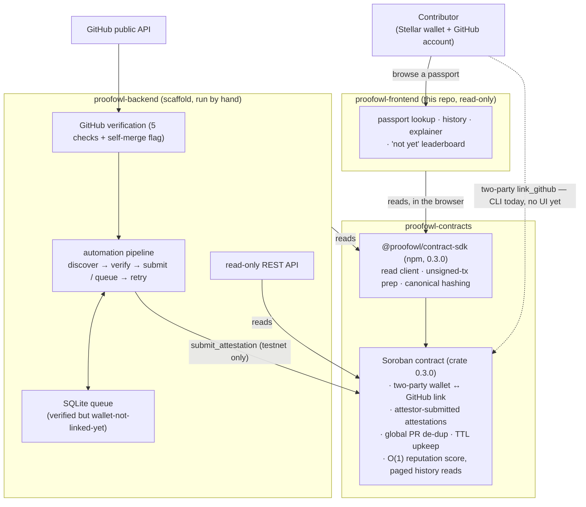

# ProofOwl — project overview

**New to ProofOwl? Start here.** This directory is org-level grounding:
what ProofOwl is as a whole, and how its three repositories fit
together. It is written from the real state of all three repos as of
**2026-09-09**, and it says plainly where they disagree with each other
rather than smoothing it over (see
[`known-limitations.md`](./known-limitations.md) §"Cross-repo
inconsistencies").

It is **not** a replacement for any repo's own `README.md` — each of
those is the authority on running and building that one component. This
is the map that sits above them.

> These documents are a point-in-time snapshot. Contract IDs, addresses,
> deployment state, and the "what's done" columns were true when this
> was written; verify against each repo's own current docs and against
> live on-chain reads before relying on any specific value.

---

## What ProofOwl is

A contributor's track record for merged open-source work — points,
complexity tiers, reviews — normally lives only inside one program's
private backend (the motivating example is
[Drips Wave](https://drips.network/wave/stellar)). That is fine for
running a funding cycle, but it means the track record is **not
portable and not independently verifiable**. There is nothing to hand a
grant committee, a DAO, or another bounty platform that says "here is my
real, verified contribution history" in a form they can check
themselves.

**ProofOwl is a minimal on-chain registry that fixes exactly that
gap.** It anchors two kinds of fact on the Stellar network (Soroban
smart contract):

1. **A two-party wallet ↔ GitHub identity link.** The contributor's
   Stellar wallet signs the linking call _and_ a trusted attestor
   co-signs it. The wallet signature proves control of the Stellar key;
   the attestor co-signature is the on-chain receipt of an off-chain
   GitHub ownership check. The contract itself has no network access and
   cannot verify GitHub — it enforces _procedure_ (both signatures
   present), not the OAuth result.

2. **Verified attestations.** One entry per confirmed, merged
   contribution to a Stellar Wave-labelled issue, submitted by the
   trusted attestor service after it independently checks GitHub's
   public API. Each attestation stores the `owner/repo` and PR number in
   the clear, so it links straight back to the merged pull request, plus
   a running reputation score.

Anyone can then query a wallet's full, checkable history from the chain.
The data outlives any single program's backend because it is not in a
backend.

### What it deliberately is _not_ yet

- **Not on mainnet.** One disposable testnet instance exists. Mainnet is
  explicitly out of scope and gated on an independent audit, a multisig
  attestor, and more — see [`roadmap-status.md`](./roadmap-status.md).
- **Not trustless.** The attestor key is a documented, load-bearing
  trust anchor. It can misreport _what_ happened; by contract design it
  cannot redirect credit to a wallet an identity has not itself linked.
- **Not a finished product.** The backend is a scaffold run by hand; the
  frontend is read-only and ships no interactive linking and no
  leaderboard. Both gaps are intentional and explained in
  [`backend.md`](./backend.md) and [`frontend.md`](./frontend.md).

---

## The three repositories

| Repo                                                                               | Language / stack                                                             | Role                                                                                                                                                                                                                | State                                                                                                                                                                                                        |
| ---------------------------------------------------------------------------------- | ---------------------------------------------------------------------------- | ------------------------------------------------------------------------------------------------------------------------------------------------------------------------------------------------------------------- | ------------------------------------------------------------------------------------------------------------------------------------------------------------------------------------------------------------ |
| [`proofowl-contracts`](https://github.com/Proofowl/proofowl-contracts)             | Rust (Soroban SDK 27), crate `0.3.0`; TypeScript SDK under `sdk/typescript/` | The Soroban contract — the on-chain source of truth. Also holds the integration spec, the ADRs, and the published `@proofowl/contract-sdk` npm package.                                                             | Contract deployed to **testnet** (one disposable v0.3 instance, plus two superseded older ones). Internal security-testing pass done; no external audit. No mainnet.                                         |
| [`proofowl-backend`](https://github.com/Proofowl/backend)                          | TypeScript, Node ≥ 22.6, Express 5, Prisma + SQLite                          | The verification service: GitHub checks, on-chain reads, the testnet-only `submit_attestation` call, a one-table queue for verified-but-unlinked contributions, an automation pipeline, and a read-only REST API.   | A **scaffold run by hand.** No always-on worker, no write HTTP API, no GitHub OAuth flow. Holds the attestor key (env var, at submit time only). One full end-to-end demo on record.                         |
| [`proofowl-frontend`](https://github.com/Proofowl/proofowl-frontend) _(this repo)_ | TypeScript, Next.js 15 (App Router), React 19                                | A **read-only** web explorer: landing/explainer, passport lookup (by wallet or GitHub handle), passport detail with paginated attestation history, an honest "not yet" leaderboard, and a "how linking works" page. | Runs against the live v0.3 testnet contract from the browser. **Never signs or submits anything.** Deployable (no infra stood up yet). Interactive linking and a real leaderboard are deliberately deferred. |

`@proofowl/contract-sdk` (published from `proofowl-contracts/sdk/typescript/`)
is the connective tissue: both the backend and the frontend depend on it
as a normal npm package. See
[`sdk-and-integration.md`](./sdk-and-integration.md).

### How they relate

Solid arrows are paths that work today. The dashed arrow — a contributor
completing a link — is a command-line flow now; no repo ships a UI or an
automated flow for it yet (the frontend cannot, because it never signs;
the backend has no OAuth flow yet).

---

## Where to go next

| Document                                                 | What it covers                                                                                                        |
| -------------------------------------------------------- | --------------------------------------------------------------------------------------------------------------------- |
| [`contracts.md`](./contracts.md)                         | The Soroban contract: purpose, the five ADRs, error model, live deployment state, the SDK's role.                     |
| [`backend.md`](./backend.md)                             | The verification pipeline, the five GitHub checks, the queue, the REST API, and exactly what is and isn't wired up.   |
| [`frontend.md`](./frontend.md)                           | This repo's role: what ships, what's deferred (interactive linking, real leaderboard) and why, current deployability. |
| [`sdk-and-integration.md`](./sdk-and-integration.md)     | How `@proofowl/contract-sdk` connects all three repos, and the two bugs fixed at its source on 2026-09-09.            |
| [`data-flow-walkthrough.md`](./data-flow-walkthrough.md) | One concrete end-to-end trace, using the real `e2e-demo` evidence on record.                                          |
| [`roadmap-status.md`](./roadmap-status.md)               | Honest phase-by-phase status against `proofowl-contracts`' own production-readiness gates.                            |
| [`known-limitations.md`](./known-limitations.md)         | A plain-language index of every currently-open limitation across all three repos, and the cross-repo inconsistencies. |
| [`glossary.md`](./glossary.md)                           | The project's vocabulary, defined once.                                                                               |

For the technical facts this frontend was built on — the browser-SDK
proof, wallet tooling, event-retention findings — see the dated
[`docs/investigation/`](../investigation/) records, which are kept as a
historical snapshot and are not maintained.
